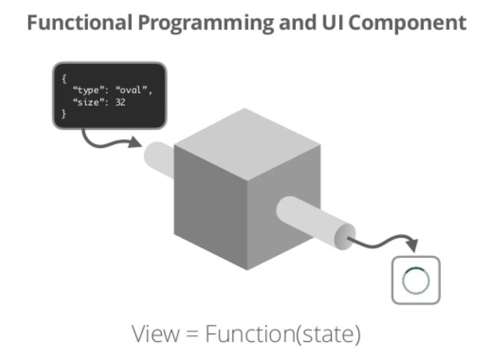

# Frontend Super Fundamental_1_컴포넌트

## 컴포넌트를 왜 쓰는걸까?

나름 프론트를 한다는 개발자인데 두리뭉실하게 대답할 수 없다,,

### 컴포넌트의 뜻

하나의 문제를 잘 해결하는 프로그램. 예로부터 모든 공학 분야의 공학자가 자주 사용해오던 문제 해결 방법. divide and conquer

### 장점

- 사고의 분산을 막고 하나의 문제에 집중함으로써 효율적으로 개발할 수 있다
- 설계의 오류를 쉽게 파악할 수 있고 상대적으로 테스트하기 쉽다
- 이식성을 높이고, 변경에 유연하게 대체할 수 있다
- 함수형 프로그래밍과 관련이 깊다 : 예기치 않은 부수효과 없이 **하나의 일을 잘 수행하는 함수** 그러한 함수를 조합/구성함으로써 큰 문제를 해결한다
- 입출력을 뚜렷하게 구분할 수 있다 : 무엇을 넣었을때 무언가를 렌더링한다. state를 넣으면 그에 맞는 view를 렌더링한다

**View=Function(state)**

### 관심사의 분리

- HTML, CSS, JS를 분리하는게 당연한 관심사의 분리라고 생각했다. 하지만..
- **템플릿은 기술의 분리일뿐 관심사의 분리가 아니다** - Pete Hunt
- 어쨋든 중요한건 **이걸로 무슨 문제를 해결하는가??** 기술이 달라 보여도 같은 문제를 해결한다면 **관심사는 같다.**
- 관심사가 같으니깐 수정시 함께 수정해야 할 확률이 높다. 이때 분리된 환경보다 한 곳에 있는 경우가 수정이 훨씬 용이하다.
- 테스트를 할때 자바스크립트만 테스트하는게 아니고,, View를 테스트하는 것이기 때문에 UI나 Style도 얼마든지 테스트의 대상이 될 수 있다. 
- 따라서 관련있는 것은 최대한 가까이에 두는 구조가 유행하고 있다. 테스트코드까지 포함해서!
- 하나의 파일에 모든 관심사를 작성하는 방식도 선호되고있다. ex)Next.js의 style jsx, Vue.js의 싱글파일컴포넌트

### 설계

- 코딩을 하기 전에 설계를 하는 단계에서, 가장 먼저 한가지 일을 수행하는 최소단위를 분석해야 한다.
- BEM은 컴포넌트에 어울리는 마크업임. 마크업을 짭시다
  - Block : 애플리케이션의 구성 요소로서 독립된 존재
  - Element : 블록을 구성하는 작은 단위, 자식 개체
  - Modifier : 블록이나 요소 테마, 동작을 표현 
- 스타일링은 SASS의 nesting, interpolation(보간)은 컴포넌트 접근법과 잘 어울린다. css도 관심사에 따라 분리할 수 있게 신경쓰자.
- context free : 상위컴포넌트의 스타일이 하위 컴넌에 영향을 주면 안된다 => 컴포넌트는 어떤 문맥에서든 자유로워야 한다.
- 만약 특정 문맥에서 컴포넌트가 변화한다면 해당 컴포넌트에 새로운 modifier를 추가해야한다.(prop)
- **무족권 자유롭게. 가만히 둬도 지혼자 잘 살아남을 수 있게**

## 튜토리얼

자바스크립트로 웹 컴포넌트를 구현해볼 것이다

1. Functional Component: proxy 객체의 원리를 이용해 반응성을 구현한 간단한 함수형 컴포넌트
2. Class Component: htmlElement 클래스를 extend해서 만든 customElement 클래스형 컴포넌트

## 보너스) Web Component W3C 표준

HTML이 기본적으로 제공하는 엘리먼트는 브라우저와 운영체제에 따라 다르게 보이는 경우도 있고, 더 발전하는 웹 환경에 대응하기에 한계가 있다. 그러나 자바스크립트는 사용이 비교적 어렵고, 크기가 커서 느리다.

## reference

- [우영주 - 컴포넌트 관점에서 개발하기](https://www.slideshare.net/UyeongJu/ss-77857699)
- [Chris Ferdinandi - How to create a state-based UI component with vanilla JS
](https://gomakethings.com/how-to-create-a-state-based-ui-component-with-vanilla-js/)
- [Chris Ferdinandi -How to create a reactive state-based UI component with vanilla JS Proxies
](https://gomakethings.com/how-to-create-a-reactive-state-based-ui-component-with-vanilla-js-proxies/)
- [A Shot Of Code - How to create a Web Component using Vanilla JS](https://www.youtube.com/watch?v=vLkPBj9ZaU0)
